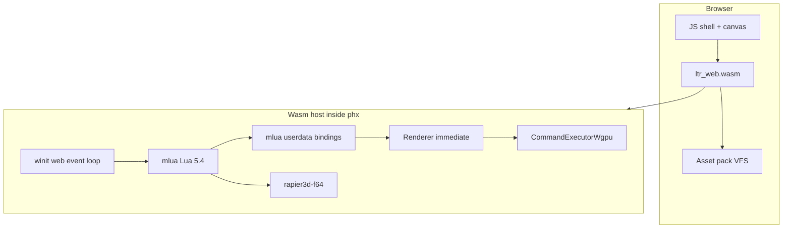

# Web Port Plan

**Goal:** Run a flyable space scene in the browser — skybox, nebula, starfield,
planets, and a player ship under keyboard/mouse control. No NPCs, trading,
economy, missions, or combat.

**Stack (chosen):** Rust → `wasm32-unknown-unknown` + **wgpu (WebGPU)** +
WASM-safe Lua (PUC-Rio via `mlua`, not LuaJIT) + asset pack / VFS.

**Desktop reference target:** `SolarSystemPlayable`
(`script/States/App/Tests/SolarSystemPlayable.lua`), trimmed of stations, maps,
HUD, autopilot, gravity wells, and asteroid streaming.

---

## Why this is a new host, not a target flip

| Current desktop stack | Web reality |
|----------------------|-------------|
| LuaJIT + LuaJIT FFI (`ffi.C`, `ffi.cast`, `jit`) | LuaJIT has no WASM target; FFI ABI is non-portable |
| OpenGL 3.3 Core + GLSL `#version 330` via glutin | Need WebGPU (wgpu) or WebGL2; GLSL 330 does not run as-is |
| Dedicated render OS thread + worker threads | Browser: prefer single-threaded `immediate` loop; workers only via message passing |
| `std::fs` / `dofile` / `lfs_ffi` for assets & scripts | Pack + fetch + in-memory VFS |
| `ltr` dynamically links `phx` cdylib | Single wasm module + JS glue |

Internal direction already points here: finish `RenderCommand` purity, then
swap the GL executor for wgpu (`ai/ideas.md` §12, `doc/engine/render-thread.md`).

---

## Success criteria (v1)

A page loads a canvas and the player can:

1. See a solar system with star, planets, skybox/nebula/starfield, and postFX
   (bloom / tonemap at minimum).
2. Pilot a fighter with existing chase/FPS controls (WASD, mouse look, boost).
3. Cycle cameras (Chase / Orbit / Free) without leaving the scene.
4. Sustain interactive framerate on a mid-range desktop GPU in Chrome/Firefox
   with WebGPU enabled.

Explicitly out of scope for v1: audio polish, gamepad, save/load, multiplayer,
full main menu, stations, HUD labels, system map, travel drive, NPCs, economy.

---

## Architecture



Reuse as much as possible above the seams:

- **Keep:** `RenderCommand` / `Renderer` API, Rapier physics, glam math,
  ECS Lua game logic for flight + celestial visuals, postFX *concept*.
- **Replace:** GL executor, LuaJIT FFI binding layer, filesystem resource
  loader, threaded renderer (force `immediate` on web), native audio/input
  extras.

---

## Phased roadmap

### Phase 0 — Desktop prep (unblocks web without shipping WASM yet)

Do this on native first so web work is mostly packaging + binding migration.

1. **Seal the render seam**
   - Ensure all GPU work goes through `RenderCommand` (no leaked `gl::*` above
     `command_executor_gl.rs`).
   - Keep `immediate` feature green; it becomes the web default
     (`engine/lib/phx/src/render/thread/`).
2. **Abstract window/GL creation**
   - Split `window/glutin_render.rs` behind a `GraphicsBackend` trait:
     `GlutinGl` (desktop) vs future `WgpuSurface`.
3. **Inventory LuaJIT FFI surface**
   - Catalog generated modules under `engine/lib/phx/script/ffi_gen/` and
     script call sites (`ffi.cast`, `ffi.C`, `require('jit')`, `lfs_ffi`).
   - Define the subset needed for the fly slice (Engine, Window, Input,
     Renderer/Draw/Shader/Tex/Mesh, Physics, math helpers).
4. **Optional beauty shortcut for web**
   - Add a path to load a **prebaked env cubemap** so nebula GPU generation
     (`Legacy.Systems.Gen.Nebula`) is not required on day one of web.

**Exit:** Desktop still OpenGL; render + window seams ready; FFI inventory
and fly-slice API list written (can live beside this doc as
`doc/web/ffi-inventory.md` when implementation starts).

---

### Phase 1 — wgpu backend on desktop

Implement `CommandExecutorWgpu` selected by a new cargo feature
(`backend-wgpu`), still running natively.

1. Map `RenderCommand` variants to wgpu
   (`engine/lib/phx/src/render/thread/command_executor_gl.rs` → sibling
   `command_executor_wgpu.rs`).
2. Port shaders under `res/shader/` from GLSL 330 → WGSL (or Naga-ingested
   GLSL ES with a validated subset). Priority order for the fly slice:
   - Geometry / materials: `metal`, `planet`, `atmosphere`, `star`, `moon`
   - Background: `skybox`, `starbg`
   - Lighting + post: deferred light passes used by `RenderCoreSystem`, then
     bloom + tonemap (+ colorgrade if cheap)
3. Prove parity with `cargo run --features backend-wgpu -- SolarSystemPlayable`
   (or a trimmed web-oriented state — see Phase 3).

**Exit:** Same fly scene on desktop through wgpu; GL remains default until
wgpu is stable.

---

### Phase 2 — WASM-safe Lua + binding rewrite

Hardest phase; schedule it in parallel with late Phase 1 once the fly-slice
API list is frozen.

1. **mlua feature switch**
   - Desktop can keep LuaJIT temporarily behind `cfg`.
   - Web (and ideally a desktop `lua54` CI job) uses `mlua` with `lua54` /
     `vendored`, **not** `luajit52`.
2. **Replace LuaJIT FFI with mlua userdata / thin wrappers**
   - New binding layer (evolve or supersede `luajit-ffi-gen`) that emits
     mlua `UserData` types instead of `extern "C"` + `ffi.cdef`.
   - Port only the fly-slice API first; stub or omit the rest.
3. **Script migration for the slice**
   - Remove `require('ffi')` / `jit` / `lfs_ffi` from the boot path used by
     the web app.
   - Keep game logic in Lua where it already is (`PlayerController`,
     `ShipFlightSystem`, `RenderCoreSystem`, celestial managers).

**Exit:** `SolarSystemPlayable` (or trimmed twin) runs on desktop with
`lua54` + new bindings (GL or wgpu).

---

### Phase 3 — Fly-slice app state

Add a dedicated, web-friendly state rather than dragging the full test app.

Suggested: `script/States/App/Tests/WebFlight.lua` (name flexible), forked
from `SolarSystemPlayable` with:

| Keep | Drop |
|------|------|
| Physics world | Stations / `StationGenerator` |
| Skybox + starfield (+ prebaked or generated nebula) | `SystemMap` / `SystemMap3D` |
| `UniverseManager` + `SolarSystemVisualizer` | `AutoPilotSystem`, `GravityWellSystem` |
| Ship + `PlayerController` + flight | `AsteroidFieldSystem` (optional later) |
| `CelestialLightingSystem` + `RenderCoreSystem` post | `GameplayHUDSystem`, `WorldLabelRenderSystem` |
| Chase / Orbit / Free cameras | Lens flare if too costly; add later |

Fixed seed (e.g. `12345`) for reproducible screenshots and eval.

**Exit:** `cargo run -- WebFlight` is the golden desktop path; fewer moving
parts than `SolarSystemPlayable`.

---

### Phase 4 — Browser host + assets

1. **Crate / packaging**
   - New binary crate e.g. `engine/bin/ltr-web` (or `ltr` with
     `cfg(target_arch = "wasm32")`) using `wasm-bindgen` + `web-sys`.
   - Drop cdylib/`Engine_Entry` dlopen model on wasm; export a start hook
     from Rust.
2. **Main loop**
   - winit web backend + `immediate` renderer.
   - Disable / cfg-out: render OS thread, `notify` shader watcher, `tiny_http`
     stats server, `directories`, raw `libc` signals, worker OS threads
     (Lua workers → stub or single-threaded).
3. **VFS + asset pack**
   - Pack required trees: `res/shader` (WGSL), `res/tex2d` (metal/surface/
     lensdirt as needed), `res/mesh` primitives, `script/**` used by
     `WebFlight`, engine Lua under `engine/lib/phx/script/`.
   - Replace `system/resource.rs` filesystem scan with pack lookup;
     Lua `dofile` / `require` read from VFS.
4. **Input**
   - Keyboard + mouse via winit web; pointer lock for FPS camera.
   - Stub gamepad (`gilrs`) and clipboard (`arboard`) on wasm.
5. **Audio (minimal)**
   - Mute or stub for v1; later kira/WebAudio from memory buffers.
6. **Shell page**
   - Minimal `index.html` + loader; WebGPU required message if unavailable.

**Exit:** `wasm-pack` / `trunk` (or equivalent) serves a page that boots
`WebFlight` and flies.

---

### Phase 5 — Performance, polish, CI

1. Cap resolution / quality presets for integrated GPUs.
2. Profile wasm: Rapier step, deferred passes, bloom; reduce work before
   adding features.
3. CI job: `wasm32` build + optional headless WebGPU smoke if infrastructure
   allows; always typecheck/build the wasm target on PR.
4. Document run instructions in this file’s appendix (filled in at
   implementation time).
5. Only then consider stretch: audio, gamepad, asteroid belts, lens flare,
   nebula live-gen, HUD.

---

## Dependency strategy (cfg matrix)

| Component | Desktop default | Web (`wasm32`) |
|-----------|-----------------|----------------|
| Lua | LuaJIT (until Phase 2 CI green) | Lua 5.4 via mlua |
| Bindings | LuaJIT FFI gen | mlua userdata |
| GPU | OpenGL executor | wgpu executor |
| Renderer threading | threaded | `immediate` only |
| Window | winit + glutin | winit web + wgpu surface |
| Assets | `std::fs` | pack + VFS |
| Audio | kira/cpal | stub → WebAudio |
| Gamepad / clipboard | gilrs / arboard | stub |
| FreeType | keep if needed | prefer swash/parley-only path; cfg-out `freetype-sys` |
| Physics | rapier3d-f64 | same (verify simd features) |

---

## Minimal runtime dependency graph (v1)

```
boot (wasm start)
  → Engine::entry / web main
  → load VFS scripts
  → States.App.Tests.WebFlight
       → Physics.Create
       → skybox (+ prebaked env or nebula gen)
       → UniverseManager + SolarSystemVisualizer
       → ShipGenerator + PlayerController + ShipFlightSystem
       → CelestialLightingSystem + RenderCoreSystem (wgpu)
```

---

## Risks and mitigations

| Risk | Mitigation |
|------|------------|
| LuaJIT FFI rewrite is huge | Bind only the fly-slice API; leave unused FFI modules desktop-only |
| Shader port cost / visual drift | Port post stack incrementally; freeze screenshots from desktop wgpu as goldens |
| Nebula generation expensive or GL-tied | Prebake cubemap for web v1 |
| Browser thread limits | `immediate` renderer; no OS worker pool on wasm |
| Wasm binary size | Compress asset pack separately; `opt-level = s` / LTO for wasm profile |
| WebGPU availability | Clear unsupported message; WebGL2 fallback is **not** in v1 scope |

---

## Suggested implementation order (summary)

1. Phase 0 seams + FFI inventory  
2. Phase 3 `WebFlight` state on desktop GL (proves slice)  
3. Phase 1 wgpu desktop parity for `WebFlight`  
4. Phase 2 Lua 5.4 + mlua bindings for that slice  
5. Phase 4 wasm packaging + VFS + browser loop  
6. Phase 5 perf / CI / polish  

Phases 1 and 2 can overlap after the API inventory is frozen; Phase 3 should
land early so both backends chase one small app.

---

## Non-goals (until after v1)

- Full `LTheoryRedux` menu and campaign flow  
- Economy, NPCs, jobs, weapons, docking  
- WebGL2 fallback  
- Keeping LuaJIT in the browser  
- Feature parity with threaded renderer or live shader hot-reload on web  

---

## Key file anchors

| Area | Path |
|------|------|
| Launcher | `engine/bin/ltr/src/main.rs` |
| Engine entry / Lua host | `engine/lib/phx/src/engine/engine.rs`, `main_loop.rs` |
| Render commands | `engine/lib/phx/src/render/thread/` |
| GL executor | `engine/lib/phx/src/render/thread/command_executor_gl.rs` |
| FFI generator | `engine/lib/luajit-ffi-gen/` |
| Fly reference state | `script/States/App/Tests/SolarSystemPlayable.lua` |
| Flight controls | `script/Modules/Constructs/Systems/PlayerController.lua`, `ShipFlightSystem.lua` |
| Space visuals | `script/Modules/Rendering/Systems/RenderCoreSystem.lua`, `res/shader/` |
| Strategic note | `ai/ideas.md` (OpenGL → wgpu) |
