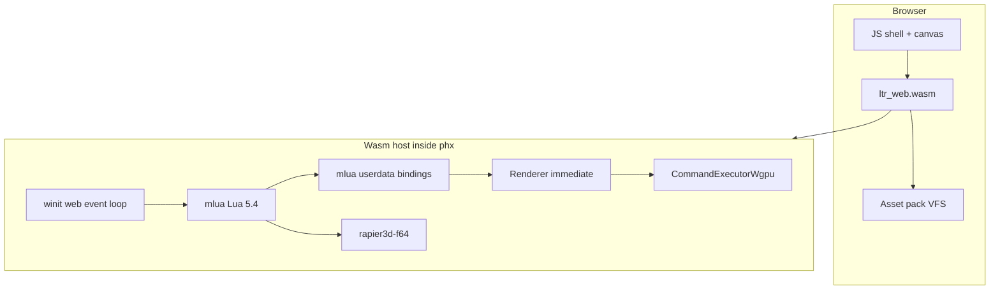

# Web Port Plan

**Goal:** The same beautiful free-flight experience as desktop Limit Theory
Redux, in the browser — procedural nebula/skybox, starfield, lit planets with
atmospheres, fighter under full camera/flight controls, and the full space
post stack. No NPCs, trading, economy, missions, or combat.

**What “slice” means here:** cut *game systems*, not *look or feel*. The web
build must not be a basic facsimile (simplified materials, missing post,
static placeholder sky, stub ship). Side-by-side with desktop
`SolarSystemPlayable` / main-game free flight, it should read as the same
game.

**Stack (chosen):** Rust → `wasm32-unknown-unknown` + **wgpu (WebGPU)** +
WASM-safe Lua (PUC-Rio via `mlua`, not LuaJIT) + asset pack / VFS.

**Desktop reference:** `SolarSystemPlayable`
(`script/States/App/Tests/SolarSystemPlayable.lua`) and the main game’s
in-flight look (`Config.render.postFx` Space grade). Web may drop stations,
maps, and HUD chrome; it must keep the visual and piloting pipeline.

---

## Fidelity bar (non-negotiable for v1)

Web v1 is accepted only when these match desktop quality for the same seed
(screenshot / A–B compare, not “roughly similar”):

| Pillar | Must include |
|--------|----------------|
| Background | Live nebula generation (or offline bake that is **indistinguishable** from desktop gen for the fixed seed), skybox, starfield |
| Celestials | Star, planets, moons, rings as materialized today — `planet` / `atmosphere` / `star` / `moon` / `planetring` materials, celestial lighting + IBL from env maps |
| Ship | Procedural fighter + metal/PBR materials; thruster visuals if desktop shows them in this mode |
| PostFX | Full Space stack from `script/Config/Render/PostFxConfig.lua`: bloom, Illustris tonemap, Space colorgrade, vignette, FXAA, sharpen, aberration, dither |
| Lens flare | `LensFlareSystem` with occlusion — not optional |
| Flight feel | Same bindings and tuning (`ShipActions`, `ShipFlightSystem`, chase/FPS/orbit/free cameras, boost, roll) |
| Lighting | Deferred path used by `RenderCoreSystem` + `CelestialLightingSystem` |

**Allowed to drop (systems / chrome only):** stations, system map 2D/3D,
autopilot, gravity wells, asteroid field streaming, gameplay HUD / world
labels, menus, economy/NPC/combat, gamepad, save/load, multiplayer.

**Not allowed as “ship later” for v1:** stripping post to bloom+tonemap only,
skipping atmospheres, grey unlit ship, flat color sky, orbit-cam-only demo,
or a one-planet toy scene that does not use the real visualizer path.

**Quality presets:** a “low” preset may exist for weak GPUs (lower res,
cheaper bloom radius), but **default web** targets the desktop Space look.
Presets scale cost; they do not delete pillars above.

---

## Why this is a new host, not a target flip

| Current desktop stack | Web reality |
|----------------------|-------------|
| LuaJIT + LuaJIT FFI (`ffi.C`, `ffi.cast`, `jit`) | LuaJIT has no WASM target; FFI ABI is non-portable |
| OpenGL 3.3 Core + GLSL `#version 330` via glutin | Need WebGPU (wgpu); GLSL 330 does not run as-is |
| Dedicated render OS thread + worker threads | Browser: `immediate` loop; workers only via message passing |
| `std::fs` / `dofile` / `lfs_ffi` for assets & scripts | Pack + fetch + in-memory VFS |
| `ltr` dynamically links `phx` cdylib | Single wasm module + JS glue |

Internal direction already points here: finish `RenderCommand` purity, then
swap the GL executor for wgpu (`ai/ideas.md` §12, `doc/engine/render-thread.md`).

---

## Success criteria (v1)

A page loads a canvas and:

1. **Looks like LTR** — for a fixed seed, web frames are visually comparable
   to desktop `SolarSystemPlayable` (same nebula character, planet lighting,
   post grade, flare). Review is side-by-side stills + short fly video.
2. **Flies like LTR** — chase/FPS piloting with existing thrust/strafe/roll/
   boost/mouse aim; camera cycle (Chase / FirstPerson / Orbit / Free).
3. **Uses the real pipelines** — `UniverseManager` + `SolarSystemVisualizer`,
   `RenderCoreSystem` post stack, `LensFlareSystem`, ship generator — not a
   parallel “web demo” renderer.
4. **Interactive** on a mid-range desktop GPU in Chrome/Firefox with WebGPU;
   low preset available without removing fidelity pillars.

Out of scope for v1 (content/systems only): NPCs, trading, economy, missions,
combat, full main menu, stations, maps, HUD chrome, gamepad, multiplayer.
Audio may ship muted initially if it does not change the visual bar; thruster /
ambience WebAudio is a fast follow, not a substitute for visuals.

---

## Architecture



Reuse above the seams:

- **Keep:** `RenderCommand` / `Renderer` API, Rapier, glam, ECS Lua for
  flight + celestial visuals, **entire** `RenderCoreSystem` post path and
  material/shader set needed for the reference scene.
- **Replace:** GL executor, LuaJIT FFI bindings, filesystem loader, threaded
  renderer (`immediate` on web), native-only input/audio hosts.

Do **not** invent a second, simpler web rendering path.

---

## Phased roadmap

### Phase 0 — Desktop prep (unblocks web without shipping WASM yet)

1. **Seal the render seam**
   - All GPU work through `RenderCommand` (no `gl::*` above
     `command_executor_gl.rs`).
   - Keep `immediate` green; it is the web default
     (`engine/lib/phx/src/render/thread/`).
2. **Abstract surface creation**
   - `GraphicsBackend`: `GlutinGl` (desktop) vs future `WgpuSurface`.
3. **Inventory LuaJIT FFI for the fidelity slice**
   - Catalog `engine/lib/phx/script/ffi_gen/` and call sites.
   - API list must cover everything the fidelity bar needs (Renderer/Draw/
     Shader/Tex/Mesh/cubemaps, Physics, Window/Input, Engine, gen helpers
     used by nebula/starfield) — not a toy subset that cannot express the
     look.
4. **Capture desktop goldens**
   - Fixed-seed stills + short clips from `SolarSystemPlayable` (GL) as the
     A–B baseline for later wgpu and web.

**Exit:** Seams ready; FFI inventory complete; golden reference set checked in
or documented under `doc/web/`.

---

### Phase 1 — wgpu backend on desktop (parity first)

`CommandExecutorWgpu` behind `backend-wgpu`, native first.

1. Map the full `RenderCommand` surface used by the flight scene (including
   cubemap / FBO / filter passes the post stack needs).
2. Port shaders for **full fidelity**, not a demo subset:
   - Materials: `metal` / `uv_metal`, `planet`, `atmosphere`, `star`, `moon`,
     `planetring`
   - Background / gen: `skybox`, `starbg`, nebula gen shaders under
     `res/shader/fragment/gen/`
   - Effects: thruster if used, `filter/lensflare`
   - Post: `bloompre` / `bloomcomposite`, `tonemap`, `colorgrade`, vignette,
     FXAA, sharpen, aberration, dither — matching `PostFxConfig`
3. Nebula: prefer **porting live gen** to wgpu so seeds stay dynamic. A bake
   is acceptable only if A–B against desktop gen for the golden seed passes
   the fidelity bar (same look, not a stock HDRI).
4. Prove: `cargo run --features backend-wgpu -- SolarSystemPlayable` (or
   `WebFlight`) matches GL goldens.

**Exit:** Desktop wgpu flight is visually on par with desktop GL; GL remains
default until stable.

---

### Phase 2 — WASM-safe Lua + binding rewrite

Hardest phase; overlap with late Phase 1 once the API list is frozen.

1. **mlua:** web (+ desktop CI job) on `lua54` / `vendored`; no `luajit52` on
   wasm.
2. **Bindings:** evolve/supersede `luajit-ffi-gen` → mlua `UserData` for the
   fidelity-slice API (complete enough for nebula, deferred, post, physics,
   input — not a minimal draw-triangle set).
3. **Scripts:** strip `ffi` / `jit` / `lfs_ffi` from the web boot path; keep
   `PlayerController`, `ShipFlightSystem`, `RenderCoreSystem`,
   `LensFlareSystem`, celestial managers as the source of truth.

**Exit:** Reference flight runs on desktop with `lua54` + new bindings on GL
or wgpu at full fidelity.

---

### Phase 3 — Web flight app state (systems trimmed, look intact)

`script/States/App/Tests/WebFlight.lua` (name flexible), forked from
`SolarSystemPlayable`:

| Keep (required) | Drop (systems/chrome) |
|-----------------|------------------------|
| Physics world | Stations / `StationGenerator` |
| Skybox + starfield + nebula (live or fidelity-grade bake) | `SystemMap` / `SystemMap3D` |
| `UniverseManager` + `SolarSystemVisualizer` | `AutoPilotSystem`, `GravityWellSystem` |
| Ship + `PlayerController` + flight | Asteroid streaming (optional add if cost allows; not a visual substitute) |
| `CelestialLightingSystem` + full `RenderCoreSystem` post | `GameplayHUDSystem`, `WorldLabelRenderSystem` |
| All flight cameras + `LensFlareSystem` | Main menu / economy / NPC paths |

Fixed seed for goldens; other seeds should still look like LTR when nebula
gen is live.

**Exit:** `cargo run -- WebFlight` is the golden path — same beauty, less
chrome.

---

### Phase 4 — Browser host + assets

1. **Packaging:** `engine/bin/ltr-web` (or wasm cfg on `ltr`) with
   `wasm-bindgen` / `web-sys`; no cdylib dlopen model.
2. **Loop:** winit web + `immediate` renderer; cfg-out OS render thread,
   `notify`, `tiny_http`, `directories`, libc signals, OS worker pools.
3. **VFS:** pack shaders (WGSL), textures (metal/surface/lensdirt/etc.),
   meshes, all scripts/assets the fidelity path touches — including nebula
   gen resources.
4. **Input:** keyboard/mouse + pointer lock; stub gilrs/arboard.
5. **Audio:** stub OK for first browser bring-up; do not block the visual
   bar. WebAudio thrusters/ambience as immediate follow-up.
6. **Shell:** `index.html` + loader; clear WebGPU-required messaging.

**Exit:** Served page boots `WebFlight` and passes the fidelity bar vs
desktop goldens.

---

### Phase 5 — Performance, polish, CI

1. Default = full look; add scalable presets (resolution, bloom radius) that
   **do not** remove materials/post/flare/nebula character.
2. Profile wasm (Rapier, deferred, bloom); optimize before adding systems.
3. CI: `wasm32` build on PRs; desktop wgpu golden smoke where possible.
4. Document run instructions in an appendix when implementation lands.
5. After v1: audio, gamepad, asteroids, stations-as-scenery, HUD — still
   without lowering the established look.

---

## Dependency strategy (cfg matrix)

| Component | Desktop default | Web (`wasm32`) |
|-----------|-----------------|----------------|
| Lua | LuaJIT (until Phase 2 CI green) | Lua 5.4 via mlua |
| Bindings | LuaJIT FFI gen | mlua userdata |
| GPU | OpenGL executor | wgpu executor |
| Renderer threading | threaded | `immediate` only |
| Window | winit + glutin | winit web + wgpu surface |
| Assets | `std::fs` | pack + VFS |
| Audio | kira/cpal | stub → WebAudio |
| Gamepad / clipboard | gilrs / arboard | stub |
| FreeType | keep if needed | prefer swash/parley-only; cfg-out `freetype-sys` if unused by fly path |
| Physics | rapier3d-f64 | same (verify simd features) |

---

## Runtime dependency graph (v1)

```
boot (wasm start)
  → Engine::entry / web main
  → load VFS scripts
  → States.App.Tests.WebFlight
       → Physics.Create
       → skybox + nebula + starfield
       → UniverseManager + SolarSystemVisualizer
       → ShipGenerator + PlayerController + ShipFlightSystem
       → CelestialLightingSystem
       → RenderCoreSystem (full post) + LensFlareSystem
       → wgpu CommandExecutor
```

---

## Risks and mitigations

| Risk | Mitigation |
|------|------------|
| LuaJIT FFI rewrite is huge | Bind the **fidelity** API surface; omit unused gameplay modules — do not shrink graphics API |
| Visual drift on shader port | Desktop GL goldens → desktop wgpu parity gate → web gate; no “good enough” merge |
| Nebula gen hard on wgpu/wasm | Port gen shaders; bake only if seed A–B passes fidelity bar |
| Browser cost of full post | Resolution/bloom presets; keep all passes available at default |
| Thread limits | `immediate` renderer; no OS worker pool on wasm |
| Wasm size | Compressed asset pack; LTO / size opts — not by deleting textures or shaders |
| WebGPU availability | Clear unsupported UX; WebGL2 fallback **out of v1** (would threaten fidelity) |

---

## Suggested implementation order

1. Phase 0 seams + FFI inventory + **desktop goldens**  
2. Phase 3 `WebFlight` on desktop GL (same look, less chrome)  
3. Phase 1 wgpu desktop **parity** with those goldens  
4. Phase 2 Lua 5.4 + mlua bindings for the fidelity API  
5. Phase 4 wasm + VFS + browser (gate on same goldens)  
6. Phase 5 perf presets / CI / audio follow-up  

---

## Non-goals (until after v1)

- Full `LTheoryRedux` menu and campaign flow  
- Economy, NPCs, jobs, weapons, docking  
- WebGL2 fallback  
- Keeping LuaJIT in the browser  
- Threaded renderer / shader hot-reload on web  
- A separate low-fi “web demo” renderer or scene  

---

## Key file anchors

| Area | Path |
|------|------|
| Launcher | `engine/bin/ltr/src/main.rs` |
| Engine entry / Lua host | `engine/lib/phx/src/engine/engine.rs`, `main_loop.rs` |
| Render commands | `engine/lib/phx/src/render/thread/` |
| GL executor | `engine/lib/phx/src/render/thread/command_executor_gl.rs` |
| FFI generator | `engine/lib/luajit-ffi-gen/` |
| Fly reference state | `script/States/App/Tests/SolarSystemPlayable.lua` |
| Flight controls | `script/Modules/Constructs/Systems/PlayerController.lua`, `ShipFlightSystem.lua` |
| Space visuals | `script/Modules/Rendering/Systems/RenderCoreSystem.lua`, `LensFlareSystem.lua` |
| Post stack config | `script/Config/Render/PostFxConfig.lua` |
| Shaders | `res/shader/` |
| Strategic note | `ai/ideas.md` (OpenGL → wgpu) |
